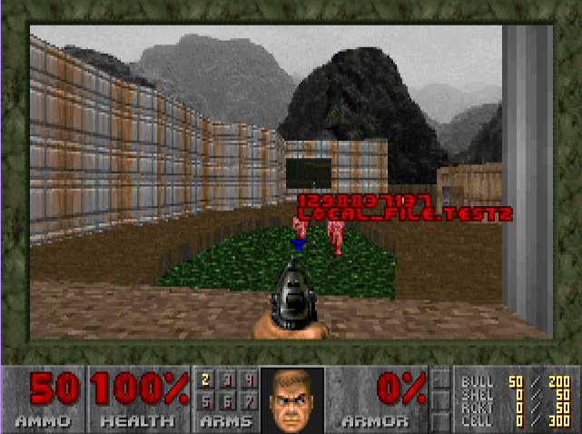

# ❤️‍🔥 tf-doom

Entertaining Terraform chaos engineering, destroy resource by killing DOOM enemies.

This is a Rust fork of [kubedoom](https://github.com/storax/kubedoom), forked from [dockerdoom](https://github.com/gideonred/dockerdoom), forked from  **`psdoom`**. 

Technically, you could run this project outside a Docker container but this was especially designed to run in one



## ℹ️ Usage

An example with the Terraform project in `./test`. Feel free to **`terraform apply`** before or after running the Docker container, both will work. This is a special case using the `local` Terraform provider with files, if you want them to get deleted, you must bind a volume into the Docker container. Otherwise it will work, but only the Terraform resources are going to be destroyed.

The Terraform project directory must be bound at `/tf` inside the container (like below).

```bash
docker run \
    -itd \
    --rm=true \
    --name tf-doom \
    -p 5900:5900 \
    -v $PWD/test:/tf \
    b0thr34l/tf-doom:2.0
```

Now you can play DOOM through a VNC client. Example with `vnclient`:

```bash
vncviewer viewer localhost:5900
```

The default password is `1234`.

You can change it by building the image yourself:

```bash
docker build .\
    -t tf-doom \
    --build-arg VNC_PASSWORD=custom_password
```

## 🔎 Cheat codes

There are some useful cheat codes in-game:
- **`idkfa`**: Get a weapon on slot 5
- **`idspispopd`**: No clip (useful to reach the mobs)
